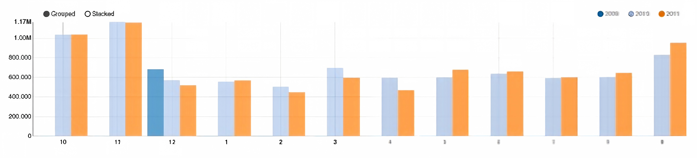
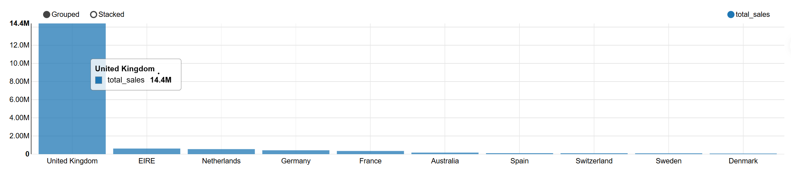
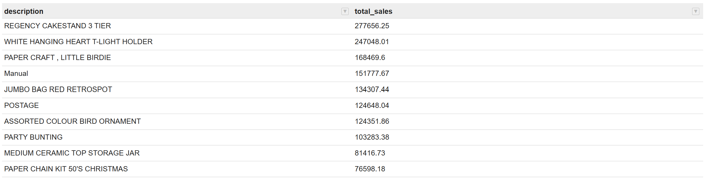
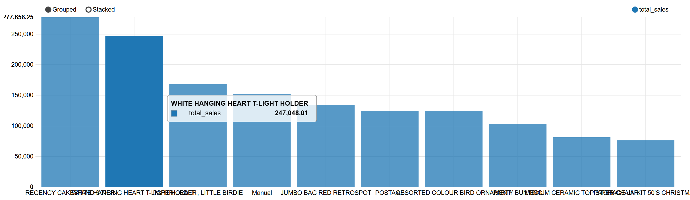
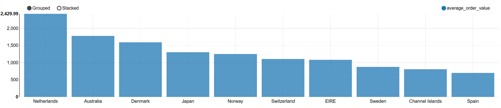

# STQD6324_Final_report-P167345-ZHANG QIAN
# Business Data Analysis for Customer, Product, and Market Decision-Making

Dataset(kaggle): Online Retail II UCI

## 1. Project Background

This project uses online retail transaction data to analyze business performance. I chose this topic and dataset because it is related to the industry and job direction that I may work in the future.

I have previous experience in marketing and sales, so I understand that data analysis is closely related to a company’s future development and its next business plan. For a company, past transaction data can help managers understand customers, products, sales performance, and market differences.

In this project, I do not only want to show how to use technical tools to clean, analyze, and explore data. I also want to practice how to use data to understand the logic behind business problems. This analysis can help a company make better decisions and also support risk management by learning from past data.

## 2. Project Objectives

The main objective of this project is to clean and analyze online retail sales data, then provide useful business insights for decision-making.

The specific objectives are:

1. To clean and prepare the raw transaction data for analysis.
2. To analyze monthly sales trends.
3. To identify the countries with the highest total sales.
4. To identify the products with the highest total sales.
5. To identify high-value customers based on total sales.
6. To compare average order value by country.
7. To provide business recommendations based on the analysis results.

## 3. Dataset

The dataset used in this project is **Online Retail II UCI** from Kaggle. I selected this dataset after considering my future interest in business, sales, and market analysis. Since I have previous experience in marketing and sales, I wanted to use a dataset that can help me practice how to understand real business problems through data.

This dataset contains online retail transaction records. It includes information about customers, products, sales quantity, invoice date, product price, and country. Because the dataset covers different business dimensions, it can be used to analyze the relationship between customers, products, sales performance, and market differences.

In this project, the dataset was uploaded to HDFS and processed using Apache Hive. The raw Hive table contained **1,067,372 rows**, including the header row. After data cleaning, the cleaned Hive table contained **779,425 valid transaction records**.

The main columns used in this project are:

| Column Name  | Description                      |
| ------------ | -------------------------------- |
| invoice      | Invoice or transaction number    |
| stock_code   | Product code                     |
| description  | Product description              |
| quantity     | Number of items purchased        |
| invoice_date | Date and time of the transaction |
| price        | Unit price of the product        |
| customer_id  | Customer identifier              |
| country      | Customer country                 |

This dataset is suitable for this project because it is comprehensive and contains useful business information. At the same time, the raw data is not fully clean. It contains data quality problems such as missing values, cancelled orders, invalid values, and duplicate records. Therefore, this dataset allows me to practice both data cleaning skills and business analysis skills.

However, this dataset also has some limitations. It only contains transaction records, so it does not include customer age, gender, marketing cost, website traffic, or customer feedback. Because of this, my analysis mainly focuses on sales performance, product performance, customer value, and country-level market performance based on the available transaction data.

## 4. Tools Used

Several tools were used in this project to complete the data management and analysis process.

| Tool            | Purpose in This Project                                              |
| --------------- | -------------------------------------------------------------------- |
| Ambari          | Used to upload the dataset into HDFS                                 |
| HDFS            | Used to store the raw dataset in the Hadoop environment              |
| PuTTY           | Used to connect to the Hadoop sandbox and run Hive commands          |
| Apache Hive     | Used to create tables, clean data, and run business analysis queries |
| Apache Zeppelin | Used to run Hive queries and create data visualizations              |
| GitHub          | Used to publish the final project files and documentation            |

These tools were used together to complete the workflow from data storage, data cleaning, data analysis, visualization, and project documentation.

## 5. Project Workflow

The project was completed through the following steps:

1. The Online Retail II dataset was selected from Kaggle because it is related to business, sales, customer, product, and market analysis.
2. The dataset was uploaded to HDFS using Ambari.
3. A Hive database named `final_report` was created.
4. A raw Hive table named `online_retail_raw` was created to store the original transaction data.
5. Data quality checks were performed to identify missing values, cancelled orders, invalid values, and duplicate records.
6. A cleaned Hive table named `online_retail_cleaned` was created for business analysis.
7. HiveQL queries were used to analyze sales trends, country sales, product sales, customer value, and average order value.
8. Apache Zeppelin was used to create data visualizations based on the Hive query results.
9. The final SQL scripts, figures, and documentation were organized for GitHub submission.

## 6. Data Cleaning

After the raw dataset was loaded into Hive, several data quality checks were performed before analysis. The purpose of this step was to remove records that may affect the accuracy of the business analysis.

The following data quality problems were checked:

| Data Quality Issue               |       Result |
| -------------------------------- | -----------: |
| Header row included in raw table |        1 row |
| Missing customer_id              | 243,007 rows |
| Missing description              |   4,382 rows |
| Cancelled orders                 |  19,494 rows |
| Invalid quantity values          |  22,950 rows |
| Invalid price values             |   6,207 rows |
| Duplicate rows                   |  34,335 rows |

The cleaning process included removing the header row, records with missing customer ID, records with missing product description, cancelled orders, records with quantity less than or equal to zero, records with price less than or equal to zero, and duplicate records.

I removed these records because they may affect the accuracy of the business analysis. For example, cancelled orders and negative quantity values do not represent normal sales transactions. Missing customer IDs also make customer-level analysis less reliable. After cleaning, the dataset became more suitable for sales, product, customer, and market analysis.

After data cleaning, a new Hive table named `online_retail_cleaned` was created. This cleaned table contained **779,425 valid transaction records** and was used for the business analysis queries.

## 7. Business Analysis and Visualizations

### 7.1 Monthly Sales Trend



I first analyzed sales performance grouped by month to understand the seasonal sales pattern of this online retail store.

From the grouped bar chart, sales revenue was generally higher in the later months of the year, especially around October and November in 2010 and 2011. The first half of the year showed relatively weaker revenue compared with the later months.

Based on my marketing understanding, this peak period may be related to stronger shopping demand before the end-of-year season. For business operations, this trend can provide useful guidance. The company can prepare stock supply, marketing campaigns, and promotional activities earlier before the high-sales period.

### 7.2 Sales Performance Across Different Countries



I aggregated all transaction records by customer country to compare total sales revenue from different markets.

The bar chart shows that the United Kingdom was the main market in this dataset, with total sales reaching about 14.4 million. This was much higher than other countries. EIRE, the Netherlands, Germany, and France also generated sales, but their total sales were much lower than the United Kingdom.

Although the United Kingdom contributed most of the revenue, other European markets should not be ignored. From a marketing perspective, these regions may become potential growth markets. The company could develop more localized marketing strategies for these countries and reduce over-reliance on a single market.

### 7.3 Top Selling Products Analysis





I summed sales revenue by product name to identify high-revenue products. Two formats were used in this part: a table to display complete product names and a bar chart to compare sales differences visually.

The results show that REGENCY CAKESTAND 3 TIER and WHITE HANGING HEART T-LIGHT HOLDER were among the top-selling products by total sales revenue. This also suggests that a small number of products contributed a large amount of sales.

For daily business management, the company should pay more attention to these high-performing products. For example, the company can prepare enough inventory for these products and use them in promotional activities. These best-selling products may also be used together with slower-moving products to improve overall sales.

### 7.4 Average Order Value by Country



Total sales revenue cannot fully reflect the value of a market, so I calculated average order value by country as a supplementary metric.

Among countries with at least 20 valid orders, the Netherlands had the highest average order value, followed by Australia, Denmark, Japan, and Norway. Although these countries did not generate the highest total sales, their customers showed higher average spending per order.

From a customer management perspective, these high-AOV markets are valuable targets for more focused marketing and customer retention plans. The company can consider premium product sets, better customer service, or targeted offers to increase profit from these high-spending customer groups.

## 8. Insights and Explanations

After exploring the cleaned transaction data with Hive queries and creating visualizations in Apache Zeppelin, I found four main business insights.

### Insight 1: Sales had seasonal changes

From the monthly grouped bar chart, sales revenue was higher in the later months of the year, especially around October and November in 2010 and 2011. This may be related to stronger shopping demand before the end-of-year period.

From a marketing view, the business should prepare earlier before the high-sales season. For example, the company can increase stock supply, prepare holiday promotions, and plan marketing activities one or two months before the peak period.

### Insight 2: The business relied heavily on the United Kingdom market

The country sales analysis shows that the United Kingdom contributed the largest part of total sales, with about 14.4 million in revenue. This means the UK was the main market in this dataset.

However, relying too much on one market may also create business risk. If local demand decreases or the market environment changes, the business may be affected. Therefore, the company should also pay attention to other active markets such as EIRE, the Netherlands, Germany, and France, and use suitable marketing strategies to develop these markets.

### Insight 3: Sales were concentrated in a few star products

The product analysis shows that a small number of products generated much higher sales than others. For example, REGENCY CAKESTAND 3 TIER and WHITE HANGING HEART T-LIGHT HOLDER were among the highest-sales products.

For business operations, these best-selling products should receive more attention in purchasing and inventory planning. The company can also use these popular products in promotion activities. For example, best-selling products can be bundled with slower-selling items to improve overall product sales.

### Insight 4: High average order value shows potential high-value markets

The average order value analysis shows that countries such as the Netherlands, Australia, Denmark, Japan, and Norway had higher spending per order. Although these countries did not have the highest total sales, their customers had stronger average purchasing value.

This means market potential should not only be judged by total revenue. Some smaller markets may still be valuable because customers there place larger orders. The company can design premium product packages, targeted offers, and customer retention plans for these high-spending customer groups.

## 9. Recommendations

Drawing on the seasonal sales trends, country sales comparison, product performance, and average order value results obtained from Hive queries and Zeppelin visualizations, I propose four business recommendations based on my marketing and sales background.

### Recommendation 1: Prepare ahead of the autumn and year-end shopping period

Monthly sales records show that sales revenue was higher around October and November, with clear growth observed in both 2010 and 2011. This trend may be related to stronger shopping demand before the end-of-year period.

Stock shortages can directly lead to lost sales opportunities, so early preparation is important before the peak season. The operation team can prepare inventory restocking plans, discount activities, and marketing campaigns one or two months in advance. Sufficient preparation can help the business respond better to seasonal demand and reduce the risk of supply shortages.

### Recommendation 2: Develop existing overseas markets to reduce reliance on the UK

The United Kingdom generated total sales of about 14.4 million, which was much higher than other countries in this dataset. This shows that the UK was the main market. However, relying too much on one market may create hidden business risks, such as local demand changes, economic changes, or regional policy adjustments.

While maintaining stable operations and regular promotions for British customers, the company should also further develop other active markets, including EIRE, the Netherlands, Germany, and France. Localized product recommendations and region-based promotions may help increase overseas sales and diversify revenue sources.

### Recommendation 3: Give priority to high-revenue products in procurement, storage, and promotion

The product-level analysis shows that sales were concentrated in a small number of products. REGENCY CAKESTAND 3 TIER and WHITE HANGING HEART T-LIGHT HOLDER stood out as top performers, with total sales of approximately 277,656 and 247,048 respectively.

These best-selling products should receive more attention in purchasing, warehouse planning, and marketing activities. The procurement and warehouse teams should make sure these products have enough stock before the high-sales period. In addition, bundle sales combining popular products with slower-moving small items may help improve overall product sales.

### Recommendation 4: Design special strategies for high-AOV overseas customer groups

The average order value results show clear differences among countries. The Netherlands had the highest average order value, reaching about 2,429.99 per order. Australia, Denmark, Japan, and Norway also showed relatively high spending per order.

Although these markets did not have the highest total sales, their customers placed larger orders on average. Instead of only focusing on increasing order quantity, the company can design premium product sets, exclusive customer discounts, and customer retention plans for these high-value groups. This may help increase customer value and encourage repeat purchases.

## 10. Conclusion

This project used the Online Retail II dataset and Hadoop ecosystem tools, including HDFS, Hive, and Zeppelin, to analyze sales, market, product, and customer performance.

After data cleaning, 779,425 valid records were kept from the original 1,067,372 rows. The key findings show year-end sales peaks, strong reliance on the UK market, sales concentration in several best-selling products, and high-AOV markets such as the Netherlands and Australia.

Overall, this project helped me understand how to clean raw data and complete a full data analysis workflow. More importantly, it showed me that historical data can be a powerful and practical tool for business planning, future management, and risk prevention.

## 11. Repository Structure

The repository is organized as follows:

```text
business-data-analysis-final-report/
│
├── README.md
├── dataset_online_retail_ii.zip
│
├── figures/
│   ├── fig01_monthly_sales_trend.png
│   ├── fig02_top_countries_by_sales.png
│   ├── fig03a_top_products_table.png
│   ├── fig03b_top_products_bar_chart.png
│   └── fig04_average_order_value_by_country.png
│
├── hive_scripts/
│   ├── 01_create_database_and_table.sql
│   ├── 02_data_cleaning_queries.sql
│   └── 03_business_analysis_queries.sql
│
├── report/
│   ├── STQD6324 Data Management_Final_Report.docx
│   └── STQD6324 Data Management_Final_Report.pdf
│
└── screenshots/
    ├── 01_hive_raw_table_preview.png
    ├── 02_data_cleaning_checks.png
    ├── 03_cleaned_table_created.png
    └── 04_monthly_sales_trend_query.png
```

`README.md` explains the project background, workflow, analysis results, insights, recommendations, and conclusion.

`dataset_online_retail_ii.zip` contains the dataset used in this project.

`figures/` contains the final visualizations created from Apache Zeppelin.

`hive_scripts/` contains the HiveQL scripts used for database creation, data cleaning, and business analysis.

`report/` contains the final report in Word and PDF format.

`screenshots/` contains supporting screenshots from Hive data loading, data cleaning checks, cleaned table creation, and business analysis queries.

## 12. Reproducibility

To reproduce this project, the user can follow these steps:

1. Upload the dataset into HDFS.
2. Run `01_create_database_and_table.sql` to create the Hive database and raw table.
3. Run `02_data_cleaning_queries.sql` to check data quality problems and create the cleaned table.
4. Run `03_business_analysis_queries.sql` to generate the business analysis results.
5. Use Apache Zeppelin to create visualizations based on the Hive query results.

These steps show how the project was completed from raw data storage to data cleaning, business analysis, and visualization.
